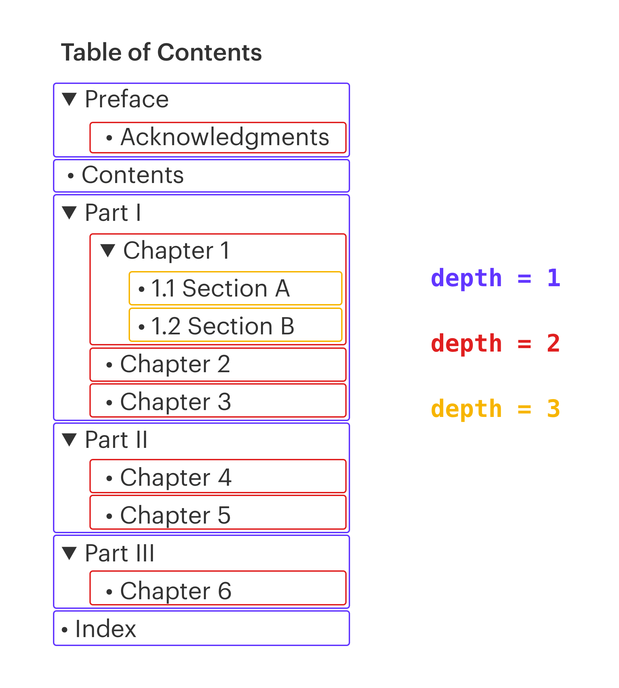

# PDF Table of Contents Splitter

Command line tool that splits a PDF file by its table of contents. Written in Python.

### Installation
First, make sure you have the required libraries installed.
```bash
pip install -r requirements.txt
```

### Splitting a PDF

```bash
python pdf_splitter.py <OPTIONS> file.pdf
```

There are four arguments:

- `--simulate`: Simulates the split. Prints the filenames, but does not create any files. Useful when checking if the options have been set correctly. 
- `--depth INTEGER`: The level of depth at which the splits will occur. See figure 1 for a visual explanation. Default value is set to 1.
- `--regex TEXT`: Selects outline items that match a RegEx pattern. For example `--regex "^Chapter"` will only select outline items that start with the string `Chapter`.
- `--overlap`: Overlaps split points. By default, if **Chapter 1** starts at page 1 and **Chapter 2** starts at page 10, `Chapter 1.pdf` will contain pages 1–9, and `Chapter 2.pdf` will contain pages 10–.... By including the `--overlap` option, `Chapter 1.pdf` will now contain pages 1–10, and `Chapter 2.pdf` will contain pages 10..., etc. This is a useful option, if a section can start in the middle of a page. 

#### Figure 1: Different levels of depth in a made up Table of Contents



### License

Licensed under AGPL.
